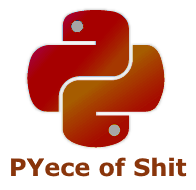
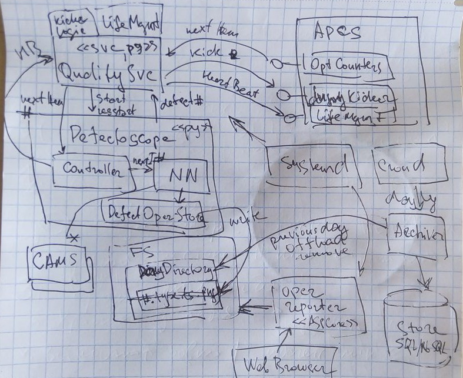
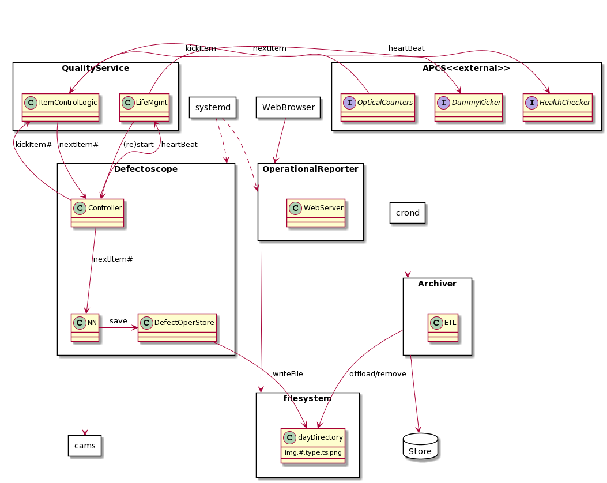
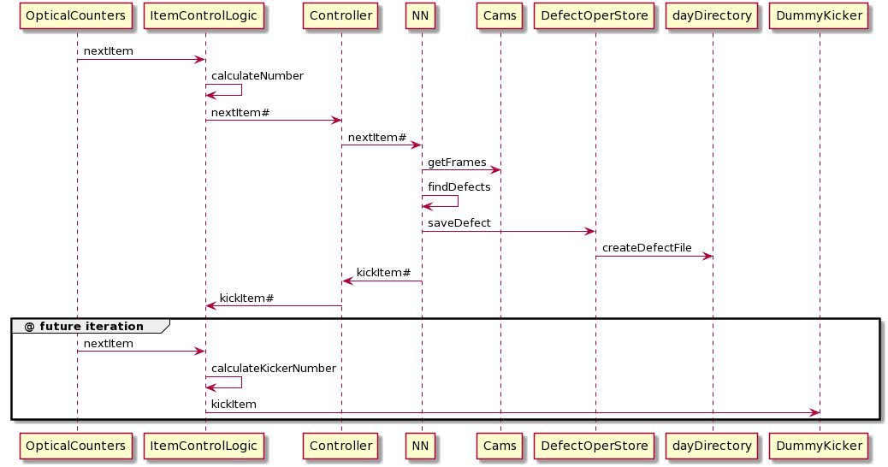

<&nbsp>
Python @ production attempt

# Top level overview

# Main sequence

# Components
* QualitySvc - py/netcore, svc
* Defectoscope - py
* OperationalReporter - aspcore, svc
* Archiver - bash/SQL/NoSQL
# Schedule
1. APCS interface API examination
2. APCS interface API logic
3. NN logic
4. Defectoscope controller and ItemController  logic
5. File storage logic
6. ETL logic
7. OperationalReporter logic
8. Processes lifetime management logic
9. systemd / crond management logic
10. Packaging
